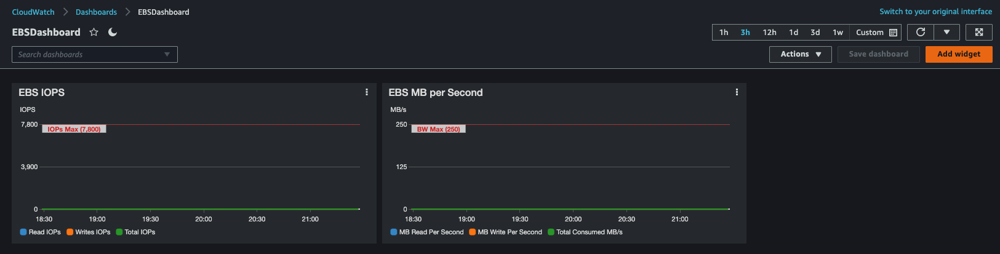
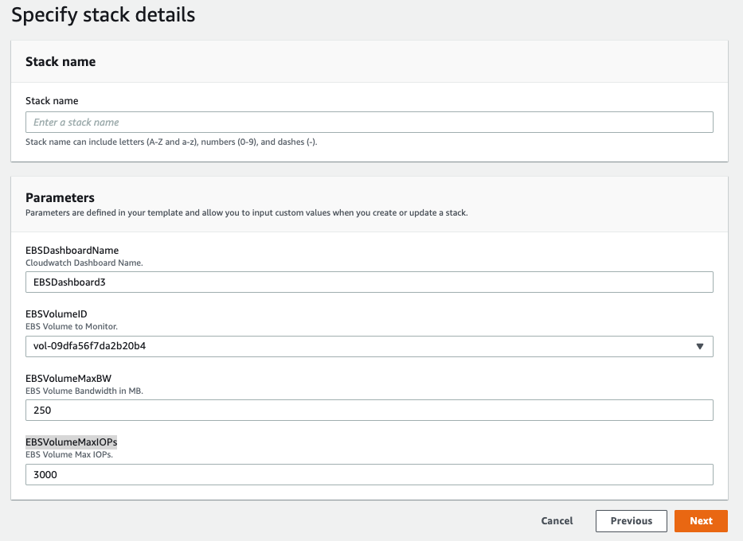
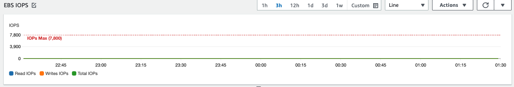
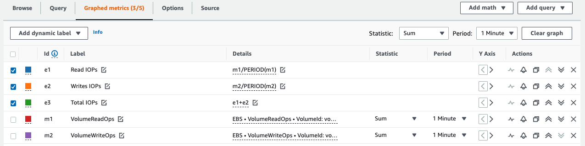
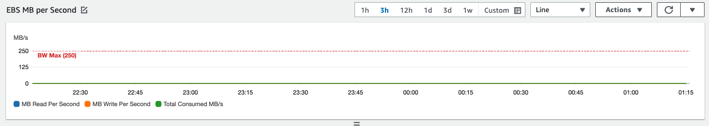
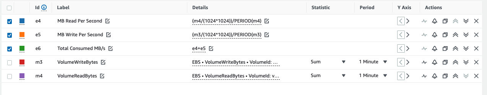

# EBS IOPs performance Cloudwatch dashboard 

When you provision an EBS volume in AWS it has two main performance contraints depending on how it is provisioned. For GP2 volumes the larger the volume the more Throughput (128MB/s 0 250MB/s) and IOPs (3 IOPs per GB in volume size). For GP3 and IO2 you configure these dimennsions when you provision the volume. *for more info see see [Table](https://docs.aws.amazon.com/AWSEC2/latest/UserGuide/ebs-volume-types.html#solid-state-drives))*


> :warning:  These graphs do not take into account Burst, which is available to those GP2 volumes with less that 3000 IOPs. GP2 volumes smaller than 1TB will have some burst IOPs (see [Burst Blog](https://aws.amazon.com/blogs/database/understanding-burst-vs-baseline-performance-with-amazon-rds-and-gp2/)))


### Install
Clone this repo and then you can run the bash script, **createebsdash.sh**, which will collect info about your ebs volume and build the dashboard.

**Automated deployment**
```
.\createebsdash.sh vol-xxxxxxxxxxxx MyEBSDashboard us-east-1

# the region is optional, and will use your aws-cli's default region in ~/.aws/configure
```


This cloudformation template takes the four inputs and creates a dashboard for 1 EBS Volume.


### Inputs
- Dashboard Name
- EBS Volume ID (Either provide the VolumeID explicitly or from the dropdown select the VolumeID)
- Provisioned IOPS or calculated IOPS for GP2 (for GP2 it will be 3 IOP per GB or storage. i.e. 1TB volume will have 3000 IOPS max. For GP3 or IO2 this number is configured with the volume)
- Max Throughput for the Volume (125MB/s for 170GB GP2 or smaller Volumes and 250MB/s for larger. For GP3 or IO2 this is set with the volume provisioning. see [Table](https://docs.aws.amazon.com/AWSEC2/latest/UserGuide/ebs-volume-types.html#solid-state-drives))


Download the Cloudformation [template](https://raw.githubusercontent.com/geseib/ebscwdash/master/ebsperfv6.yml) **right click and save locally** and launch it using the following bash shell script which uses aws-cli (if not already installed, requires [AWS CLI](https://docs.aws.amazon.com/cli/latest/userguide/cli-chap-install.html)):


**Automated deployment**
```
.\createebsdash.sh vol-xxxxxxxxxxxx MyEBSDashboard us-east-1

# the region is optional, and will use your aws-cli's default region in ~/.aws/configure
```

or run from the [AWS Console](https://us-east-1.console.aws.amazon.com/cloudformation/home?region=us-east-1#/stacks/create/template), click **Upload a template file**, and click **Choose file**, choose the YAML file you downloaded above. 



After a minute, you can select the URL from the Outputs tab in the Cloudformation console, or go to the Cloudwatch console and select your new dashboard.

## About the Metrics
In order to get accurate reading we need to grab a few EBS metrics and use the **metric math** feature in **Amazon Cloudwatch**. We will setup two graphs; one for the IOPs and one for the Throughput. 

### EBS IOPs Graph


We will need to calculate the IOPs from the Ops metrics as below.



| Visible | **id** | **Label**      | **Details**                                   | **Statistic** | **Period** |
|---------|--------|----------------|-----------------------------------------------|---------------|------------|
|    *    | e1     | Read IOPs      | m1/PERIOD(m1)                                 |               |            |
|    *    | e2     | Write IOPs     | m2/PERIOD(m2)                                 |               |            |
|    *    | e3     | Total IOPs     | e1+e2                                         |               |            |
|         | m1     | VolumeReadOps  | EBS.VolumeReadOps.VolumeId:vol-xxxxxxxxxxxxx  | Sum           | 1 Minute   |
|         | m2     | VolumeWriteOps | EBS.VolumeWriteOps.VolumeId:vol-xxxxxxxxxxxxx | Sum           | 1 Minute   |

Here is the source code for **EBS Volume IOPs** *(be sure to replace **vol-xxxxxxxxxxxxxx** with the VolumeId of your EBS volume and the region)*
```
{
    "metrics": [
        [ { "expression": "m1/PERIOD(m1)", "label": "Read IOPs", "id": "e1", "region": "us-east-1" } ],
        [ { "expression": "m2/PERIOD(m2)", "label": "Writes IOPs", "id": "e2", "region": "us-east-1" } ],
        [ { "expression": "e1+e2", "label": "Total IOPs", "id": "e3", "region": "us-east-1" } ],
        [ "AWS/EBS", "VolumeReadOps", "VolumeId", "vol-xxxxxxxxxxxxxxxxx", { "id": "m1", "visible": false } ],
        [ ".", "VolumeWriteOps", ".", ".", { "id": "m2", "visible": false } ]
    ],
    "view": "timeSeries",
    "stacked": false,
    "region": "us-east-1",
    "stat": "Sum",
    "period": 60,
    "yAxis": {
        "left": {
            "label": "IOPS",
            "showUnits": false
        },
        "right": {
            "label": "",
            "showUnits": false
        }
    },
    "annotations": {
        "horizontal": [
            {
                "label": "IOPs Max",
                "value": 100
            }
        ]
    },
    "title": "EBS IOPS"
}
```


## EBS Throughput Graph


We will need to calculate the Throughput from the Ops metrics as below.


| Visible | Id | Label               | Details                                      | Statistic | **Period** |
|---------|----|---------------------|----------------------------------------------|-----------|------------|
| *       | e4 | MB Read Per Second  | (m3/(1024*1024))/PERIOD(m3)                  |           |            |
| *       | e5 | MB Write Per Second | (m3/(1024*1024))/PERIOD(m3)                  |           |            |
| *       | e6 | Total Throughput    | e4+e5                                        |           |            |
|         | m3 | VolumeReadBytes     | EBS.VolumeReadBytes:VolumeId:volxxxxxxxxxxx  | Sum       | 1 Minute   |
|         | m4 | VolumeWriteBytes    | EBS.VolumeWriteBytes:VolumeId:volxxxxxxxxxxx | Sum       | 1 Minute   |

Here is the source code for **EBS Volume Throughput** *(be sure to replace **vol-xxxxxxxxxxxxxx** with the VolumeId of your EBS volume and the region)*
```
{
    "metrics": [
        [ { "expression": "(m4/(1024*1024))/PERIOD(m4)", "label": "MB Read Per Second", "id": "e4", "region": "us-east-1" } ],
        [ { "expression": "(m3/(1024*1024))/PERIOD(m3)", "label": "MB Write Per Second", "id": "e5", "region": "us-east-1" } ],
        [ { "expression": "e4+e5", "label": "Total Consumed MB/s", "id": "e6", "region": "us-east-1" } ],
        [ "AWS/EBS", "VolumeWriteBytes", "VolumeId", "vol-xxxxxxxxxxxxxxxxx", { "id": "m3", "visible": false } ],
        [ ".", "VolumeReadBytes", ".", ".", { "id": "m4", "visible": false } ]
    ],
    "view": "timeSeries",
    "stacked": false,
    "region": "us-east-1",
    "stat": "Sum",
    "period": 60,
    "yAxis": {
        "left": {
            "label": "MB/s",
            "showUnits": false
        },
        "right": {
            "label": "",
            "showUnits": false
        }
    },
    "annotations": {
        "horizontal": [
            {
                "label": "BW Max",
                "value": 128
            }
        ]
    },
    "title": "EBS Throughput MB/s"
}
```

## EBS Latency Graph
We will need to calculate the Throughput from the Ops metrics as below.


| Visible | Id | Label               | Details                                      | Statistic | **Period** |
|---------|----|---------------------|----------------------------------------------|-----------|------------|
| *       | e3 | Average Read/Write Combined Latency  | e1+e2                  |           |            |
| *       | e1 | Average Read Latency | (m2/m1)*1000                  |           |            |
| *       | e2 | Average Write Latency | (m2/m1)*1000                                        |           |            |
|         | m2 | VolumeTotalReadTime     | EBS.VolumeTotalReadTime:VolumeId:volxxxxxxxxxxx  | Sum       | 1 Minute   |
|         | m1 | VolumeReadOps    | EBS.VolumeReadOps:VolumeId:volxxxxxxxxxxx | Sum       | 1 Minute   |
|         | m4 | VolumeTotalWriteTime     | EBS.VolumeTotalWriteTime:VolumeId:volxxxxxxxxxxx  | Sum       | 1 Minute   |
|         | m3 | VolumeWriteOps    | EBS.VolumeWriteOps:VolumeId:volxxxxxxxxxxx | Sum       | 1 Minute   |

Here is the source code for **EBS Volume Latency** *(be sure to replace **vol-xxxxxxxxxxxxxx** with the VolumeId of your EBS volume, and the region)*
```
{
    "metrics": [
        [ { "expression": "e1+e2", "label": "Average Read/Write Combined Latency", "id": "e3", "region": "us-east-1" } ],
        [ { "expression": "(m2/m1)*1000", "label": "Average Read Latency", "id": "e1", "region": "us-east-1" } ],
        [ { "expression": "(m4/m3)*1000", "label": "Average Write Latency", "id": "e2", "region": "us-east-1" } ],
        [ "AWS/EBS", "VolumeTotalReadTime", "VolumeId", "vol-xxxxxxxxxxxxxcxxx", { "id": "m2", "visible": false } ],
        [ ".", "VolumeReadOps", ".", ".", { "id": "m1", "visible": false } ],
        [ ".", "VolumeTotalWriteTime", ".", ".", { "id": "m4", "visible": false } ],
        [ ".", "VolumeWriteOps", ".", ".", { "id": "m3", "visible": false } ]
    ],
    "view": "timeSeries",
    "stacked": false,
    "region": "us-east-1",
    "stat": "Sum",
    "period": 60,
    "title": "Volume Read Write Latency",
    "yAxis": {
        "left": {
            "label": "ms",
            "showUnits": false
        }
    }
}
```
## Testing throughput
Its important to understand how EBS IO is merged for small sequencial IO (when smaller than 256KB total) or split up for larger IO (when larger than 256KB). Becuase of this neuance you may see numbers that dont match up exactly to expectations. Try to understand your applications IO Characteristics to optimize performance and for understanding metric reporting. 

**Amazon Linux 2 Benchmark example**
1. First identify the block device you want to test using **lsblk** command
```
sh-4.2$ lsblk
NAME          MAJ:MIN RM  SIZE RO TYPE MOUNTPOINT
nvme1n1       259:0    0 1000G  0 disk 
nvme0n1       259:1    0    8G  0 disk 
├─nvme0n1p1   259:2    0    8G  0 part /
└─nvme0n1p128 259:3    0    1M  0 part 
```

2. Install a benchmarking tool such as **fio**
```
sudo yum install -y fio
```
3. create a **fio** config file that mimic your expected profile. In this example the block size is 64k
**filename: fio_rw_mix.cfg**
```
[global] 
clocksource=clock_gettime
randrepeat=0
runtime=360
 
[random-write]
bs=64k
ioengine=libaio
direct=1
iodepth=8
filename=/dev/nvme1n1
do_verify=0
rw=randwrite
rwmixread=0
rwmixwrite=100 

[random-read] 
bs=64k
ioengine=libaio
direct=1
iodepth=8
filename=/dev/nvme1n1
do_verify=0
rw=randread
rwmixread=100
rwmixwrite=0
offset=100g
```

4. Run **fio** with the config file using **sudo**.
```
sudo fio fio_rw_mix.cfg
```
5. verify the throughput and IOPs with *fio*s output (in this example throughput is ~100MB in each direction, less than this volumes max throughput. It also shows ~1500IOPs in each direction, matching its IOPs max of 30000). Typically one or the other constraint will be reached, but not both. Larger blocksizes will reach throughput contraint first, while smaller blocksizes will reach IOPs contraint first.  
```
obs: 2 (f=2): [w(1),r(1)] [6.4% done] [100.7MB/89177KB/0KB /s] [1609/1393/0 iops] [eta 05m:37s]
```

###Understanding how IOPs can go over expected Maximum
Recall that EBS will attempt to merge smaller sequencial IO operations. When that happens, the IOPs from the OS's perspective is higher that the operations the EBS is actually performing behind the scenes. We can test this wby changing our test to use 32KB blocksizes and remove the randomness of the read/write test.

1. create a new **fio** config file that uses sequencial operations (remove *rand* for both **rw** lines). In this example the block size is 32KB
**filename: fio_seq_rw_mix.cfg**
```
[global] 
clocksource=clock_gettime
randrepeat=0
runtime=360
 
[sequential-write]
bs=64k
ioengine=libaio
direct=1
iodepth=8
filename=/dev/nvme1n1
do_verify=0
rw=write
rwmixread=0
rwmixwrite=100 

[sequential-read] 
bs=32k
ioengine=libaio
direct=1
iodepth=8
filename=/dev/nvme1n1
do_verify=0
rw=read
rwmixread=100
rwmixwrite=0
offset=100g
```

2. Run **fio** with the config file using **sudo**.
```
sudo fio fio_seq_rw_mix.cfg
```
3. verify the throughput and IOPs with *fio*s output (in this example throughput is ~125MB in each direction, equal to this volumes max throughput. It also shows ~4000IOPs in each direction, 2.6x its IOPs max of 3000). But if we divide the max blocksize of 256KB by the tested 32KB, you see that the combined operations is still less that the 3000 max IOPs provided (256/32 = up to 8IOPs combined 4000IOPS/8 =500IOPs in each direction). So here we ran into a throughput constraint.  
```
Jobs: 2 (f=2): [W(1),R(1)] [1.9% done] [125.9MB/124.9MB/0KB /s] [4028/3994/0 iops] [eta 05m:53s]
```
## Summary
While these metrics can be a good place to start, it can be difficult to really know how random or sequential your application will be at all times, thus showing the impact of the limits. It is important to look at other metrics as well. I will look to investigate how VolumeQueuelength can also provide insights into performance.

