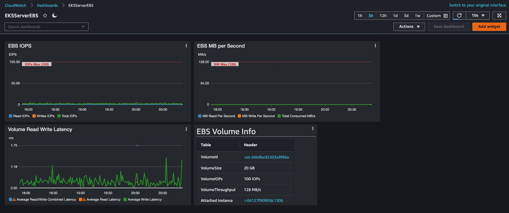

# EBS IOPs performance Cloudwatch dashboard 
This cloudformation template takes the four inputs and creates a dashboard for 1 EBS Volume.


###Inputs
- Dashboard Name
- EBS Volume ID (Either provide the VolumeID explicitly or from the dropdown select the VolumeID)
- Provisioned IOPS or calculated IOPS for GP2 (for GP2 it will be 3 IOP per GB or storage. i.e. 1TB volume will have 3000 IOPS max. For GP3 or IO2 this number is configured with the volume)
- Max Throughput for the Volume (125MB/s for 170GB GP2 or smaller Volumes and 250MB/s for larger. For GP3 or IO2 this is set with the volume provisioning. see [Table](https://docs.aws.amazon.com/AWSEC2/latest/UserGuide/ebs-volume-types.html#solid-state-drives))


Download the Cloudformation [template](ebsperfv4.yml) and launch it:

```
aws cloudformation create-stack --stack-name myEBSIOPSDashboard --template-body file://ebsperfv4.yml --parameters ParameterKey=EBSDashboardName,ParameterValue=EBSDashboard ParameterKey=EBSVolumeID,ParameterValue=vol-123456789abcdefg ParameterKey=EBSVolumeMaxBW,ParameterValue=250 ParameterKey=EBSVolumeMaxIOPs,ParameterValue=3000
```
or run from the [AWS Console](https://us-east-1.console.aws.amazon.com/cloudformation/home?region=us-east-1#/stacks/create/template), click **Upload a template file**, and click **Choose file**, choose the YAML file you downloaded above. 


After a minute, you can select the URL from the Outputs tab in the Cloudformation console, or go to the Cloudwatch console and select your new dashboard.

